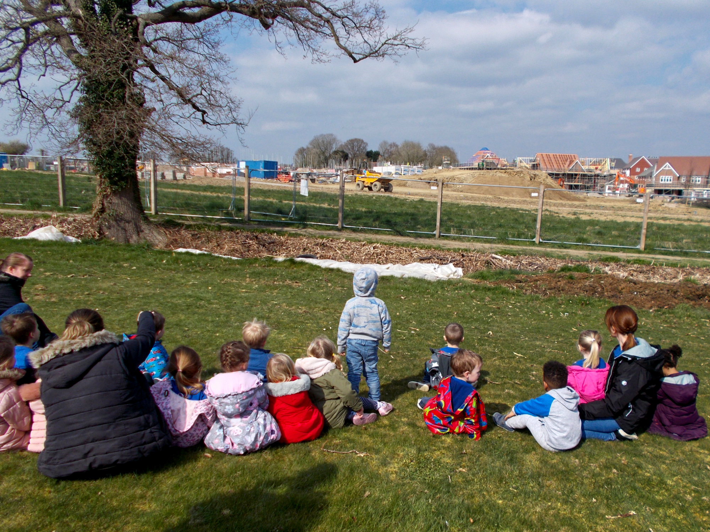

Southwater Village Hall Pre-School opened as a charity in June 1974, registered charity number 1027293. It is still the only non-profit-making pre-school in the village of Southwater. We are a member of the Early Years Alliance, a national body dedicated to the provision of childcare. We are registered with Ofsted Early Years Directorate and with W.S.C.C for free entitlement funding to ensure national standards are adhered to.

We aim to provide your child with a safe, caring environment in which they can be encouraged to learn through play and planned activities These activities are guided by the Early Years Foundation Stage (EYFS).

All children in the early years need a safe and stimulating environment. We aim to provide children with generous care and attention from qualified staff, as well as volunteer parent helpers. We want children to join with other children and adults to live, play, work and learn together. Sessions are organised so that children can choose from, and work at, a variety of activities and, in doing so, build up their ability to select and work through a task to completion. The children are also helped and encouraged to take part in adult-led small and large group activities, which introduce them to new experiences and help them to gain new skills, as well as helping them to learn to work with others. We see parents as partners in helping each child to learn and develop. Our pre-school recognises parents as the first and most important educators of their children. Parents are seen as partners in providing care and education for their children.”Heather Clarke, Pre-school manager
We currently operate from two halls within the Village Hall. We are registered with Ofsted for up to 42 children. In 2020 we have a brand new, large and dedicated outside fenced play area.
