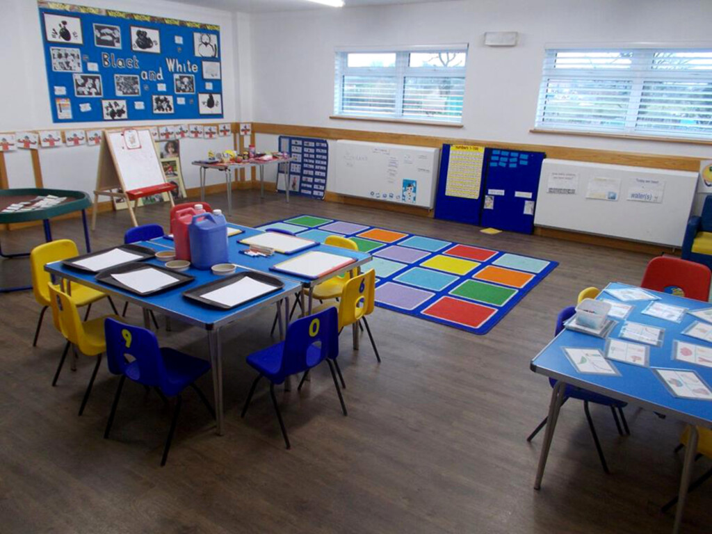

We hold consultation meetings with parents to talk about your child’s progress.

Each new child is assigned a member of staff (Key Person), who initially helps them settle into Pre-School. It is their ongoing responsibility to encourage the child in their new environment, to observe and record their achievements, and to identify areas for future development.

To support your child’s progress, we encourage you to liaise regularly with their Key Person. They are generally available before and after each session, or if necessary an appointment can be arranged. Some information from the journal will be shared with other settings/carers that your child may attend. Relevant information will be given to the infant schools during the summer term prior to children starting in the following Autumn term.

The Key Person is also responsible for keeping your child’s Learning Journal up to date. This journal is a developmental record containing information, photographs and examples of activities. It is shared with parents and eventually passed on to the appropriate Infant School.
