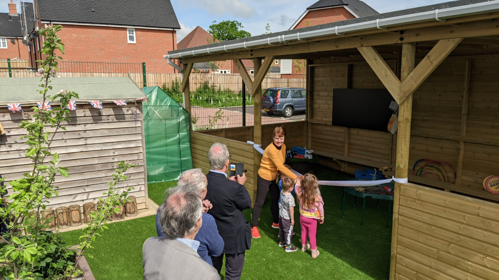
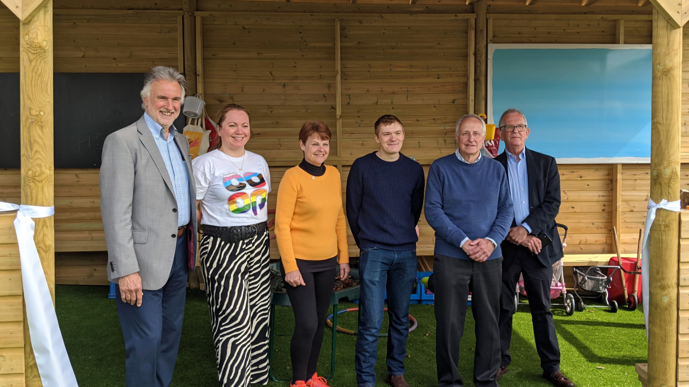

We are delighted to announce that Southwater Village Hall Preschool has recently unveiled a brand new outdoor learning area, which is now available for use by your little ones. We owe our sincere thanks to the generous support of the Southwater Village Hall, Southwater CO-OP, and Southwater Parish Council, who have made this incredible addition possible.

With this new outdoor space, your children will have access to a large sheltered area where they can learn and play all year round! This latest addition is in addition to the purpose-built playground and garden that we have proudly offered since 2020.

We are excited to offer this new opportunity for your children to explore and learn in a fun, safe, and stimulating environment. Please do not hesitate to [contact](/contact) us if you have any questions or if you would like to schedule a visit to see the new outdoor learning area firsthand.

